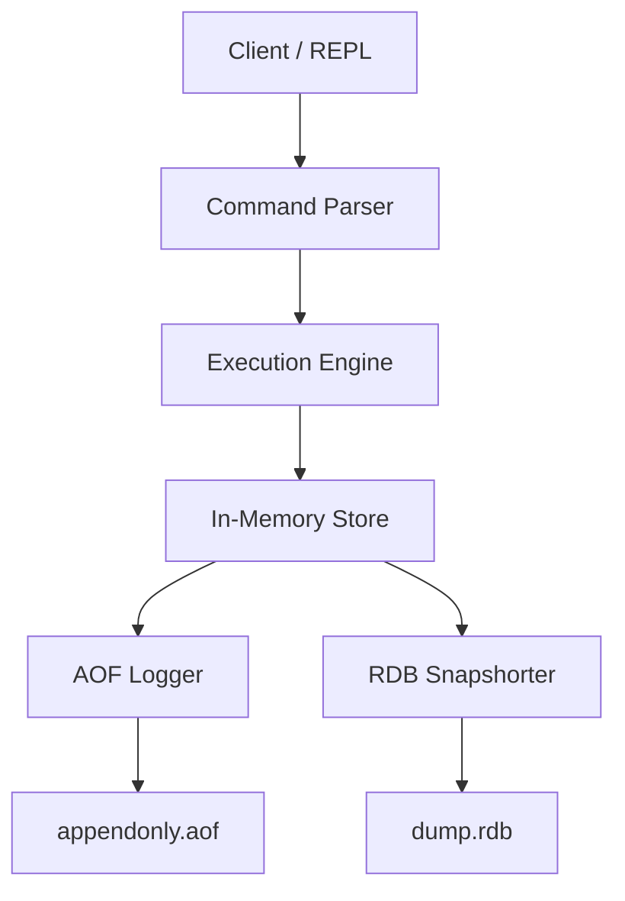

# RustDB Architecture (Redis-like)

RustDB is a high-performance in-memory key-value store with integrated disk persistence.

## 🏗️ High-Level Design

The architecture is centered around an **In-Memory Store** that serves all read/write requests, with a background **Persistence Layer** that ensures durability.

---

## 🧩 Components

### 1. In-Memory Store
- **Data Structure:** A `HashMap` where keys are `Strings` and values are a custom `Value` enum (supporting String, List, Set, etc.).
- **Performance:** O(1) average time complexity for most operations.

### 2. Persistence Layer
RustDB uses two methods for persistence:
- **Append Only File (AOF):** Logs every write operation. It is high-durability but can grow large.
- **RDB Snapshotting:** Periodically saves a point-in-time binary representation of the dataset. It is fast to load but less frequent than AOF.

### 3. Execution Engine
- Processes commands and updates the In-Memory Store.
- Triggers AOF writes for every "Write" command (SET, LPUSH, etc.).
- Manages key expiration (TTL).

---

## 🔄 Command Life Cycle

1.  **Request:** User sends `SET user:1 "Alice"`.
2.  **Parse:** The parser validates the syntax.
3.  **Execute:** The Execution Engine updates the `HashMap`.
4.  **Log:** The `SET` command is appended to `appendonly.aof`.
5.  **Respond:** "OK" is returned to the user.

---

## 🛠️ Implementation Strategy
- **Phase 1-2:** Focus on single-threaded, synchronous execution for simplicity.
- **Phase 3-4:** Introduce more complex data structures and basic serialization.
- **Phase 5-6:** Explore concurrency (handling background saves and multiple clients simultaneously).
