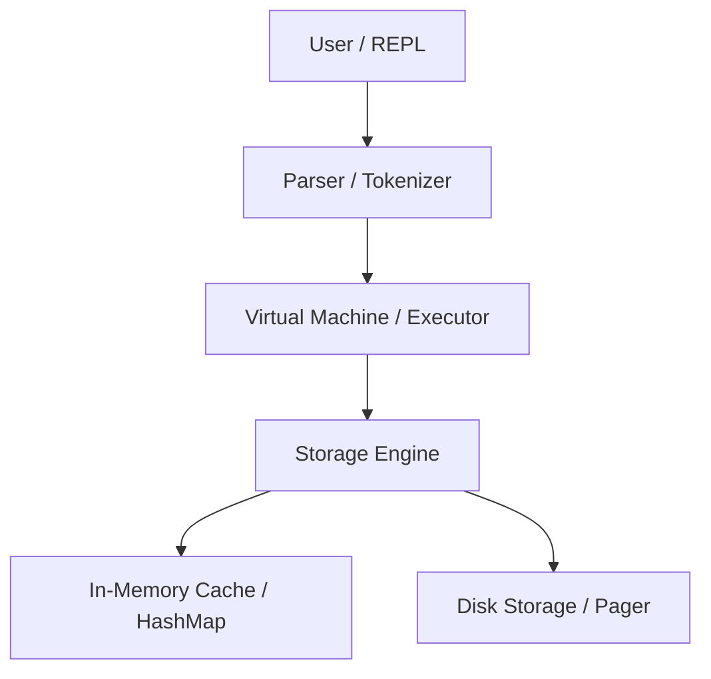

# RustDB System Architecture

This document describes the high-level architecture of RustDB. The design is modular to ensure it is easy to understand, test, and extend.

## 🏗️ High-Level Overview

RustDB follows a layered architecture similar to SQLite, where each layer has a specific responsibility.

---

## 🧩 Core Components

### 1. Front-end: The REPL (Read-Eval-Print Loop)
- **Responsibility:** The interface between the user and the database.
- **Workflow:** Reads a line from `stdin`, sends it to the Parser, and prints the result or error message back to the user.
- **Rust Concepts:** `std::io`, `match` expressions, infinite loops.

### 2. The Parser & Tokenizer
- **Responsibility:** Translates raw string input into structured commands that the database understands.
- **Commands:**
    - **Meta-commands:** Commands starting with a dot (e.g., `.exit`, `.help`).
    - **SQL-like Statements:** Commands like `INSERT`, `SELECT`, `GET`, `SET`.
- **Output:** An `Enum` (e.g., `StatementType`) representing the action and its parameters.
- **Rust Concepts:** Enums, `String` manipulation, `Result` type.

### 3. The Virtual Machine (VM) / Executor
- **Responsibility:** The "brain" of the database. It takes the parsed statement and determines how to execute it by calling the appropriate methods on the Storage Engine.
- **Workflow:** If the statement is an `INSERT`, it tells the Storage Engine to store the data.
- **Rust Concepts:** Pattern matching, error propagation.

### 4. Storage Engine
- **Responsibility:** Manages how data is organized and retrieved.
- **Sub-components:**
    - **Memory Backend:** Initially a `HashMap<String, String>` for Phase 2.
    - **Table Manager:** Manages fixed-size rows and schemas (Phase 4).
    - **Pager (Future):** Manages reading/writing fixed-size pages (e.g., 4KB) to disk.
- **Rust Concepts:** `HashMap`, `Vec`, Structs, Traits.

### 5. Persistence Layer (Disk)
- **Responsibility:** Ensures data durability.
- **Format:** Initially JSON (via `serde`), moving towards a custom binary format for performance and complexity.
- **Rust Concepts:** `File` I/O, Serialization/Deserialization.

---

## 🔄 Data Flow Example: `SET name "Rust"`

1.  **REPL:** User types `SET name "Rust"`.
2.  **Parser:** Tokenizes the string and identifies it as a `SET` statement with key=`name` and value=`Rust`.
3.  **VM:** Receives the `SET` statement and calls `storage_engine.insert("name", "Rust")`.
4.  **Storage Engine:** Updates its internal `HashMap`.
5.  **Persistence (Optional/Auto):** If auto-flush is enabled, the Storage Engine serializes the state to `database.db`.

---

## 🛠️ Future Architectural Goals
- **Buffer Management:** Implementing a cache to keep frequently accessed pages in memory.
- **B-Tree Indexing:** Moving from a simple `HashMap` or `Vec` to a B-Tree for sorted, efficient disk-based lookups.
- **Concurrency:** Using `Arc<Mutex<T>>` or `RwLock` to allow multiple readers or writers (Advanced).
